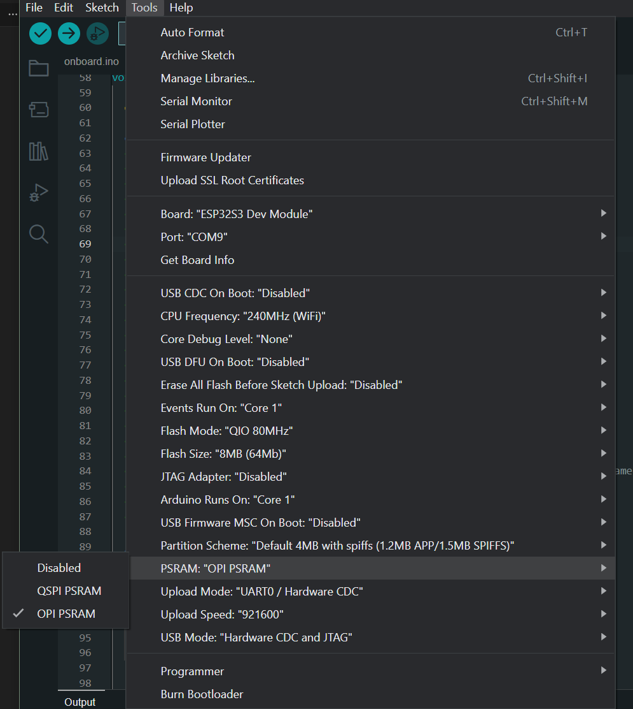

# Microcontroller Usage - Notes

This repository serves to demonstrate more hard to find/grasp, lesser talked about, or usually poorly explained concepts in microcontroller development using Arduino. Concepts here work for Pi Pico, Esp32-SX and Arduino Uno unless specified otherwise.

*Due to the closed source nature of my latest project with the Växjö Linnaeus Science Park, any descriptions used from it will only be posted here after being sufficiently decontextualized.*

## Contents
    1.0.................. Arduino OTA Updates

    2.0.................. ESP32 Image Capture
        2.1.............. Camera Initialization
        2.2.............. Camera Buffer
        2.3............... Camera de-init

    3.0.................. String Precautions

    4.0.................. Networking
        4.1.............. Wi-Fi Connections
        4.2.............. Getting Correct Time
        4.3.............. Keeping Connections

    5.0.................. Sensor Reading
    
    6.0.................. Multi-Core Usage


## 1.0. Arduino OTA Updates

The ability to update networked projects can take a normal IoT project to the next level by removing the need for disassembly and possible remounting during updates. 

This can be done a number of ways, though the general-purpose solution is using an HTTP server to retrieve the updated firmware.

There are a number of ways to specify this control flow, though the easiest is this:

    -> Board sends current firmware version number (as String) to server.
    -> Server checks against most updated version number.
        -> If update is needed, server sends HTTP_UPDATE_OK (200 OK) with firmware .bin file.
        -> If no update is needed, server sends HTTP_UPDATE_NO_UPDATES (304 Not Modified) and optinonal message.
    
    -> Update happens automatically and board restarts.
    -> If server error of any kind, the return value we see later is HTTP_UPDATE_FAILED.

One of the simplest ways to accomplish this is in [ota.cpp](ota.cpp):

```cpp
t_httpUpdate_return ret = httpUpdate.update(*CLIENT, HOST.toString(), PORT, "/", firmware_version); 
```

- CLIENT:-> Reference to WifiClient.
- HOST:-> Address of server.
- "/":-> Route on server to access. In the example here it's the root directory.

Here. "ret" will return (1) of the (3) values we specified earlier. We can handle this easily with a switch statement:

```cpp
switch (ret) {
    case HTTP_UPDATE_FAILED:
      debugf("HTTP_UPDATE_FAILED Error (%d): %s\n", httpUpdate.getLastError(), httpUpdate.getLastErrorString().c_str());
      break;

    case HTTP_UPDATE_NO_UPDATES:
      debugln("HTTP_UPDATE_NO_UPDATES");
      break;

    case HTTP_UPDATE_OK:
      debugln("HTTP_UPDATE_OK");
      break;
  }
```
To reliably check for updates now, we first call this function in our setup before any other functionality whihc may break our ability to connect to our server, such as sensor initialization. Then, we call this at a given point in our main program loop. 

This '.update()' is overloaded for use with both the WiFiClient and WiFiClientSecure for HTTP(S). It's also available to use with with HTTPClient and ESPHTTPCLient, though I've had mixed results using those versions for just HTTP. 
Current in most projects, I still reserve use of WiFiClient for OTA updates.


## 2.0. ESP32-SX Image Capture

The ESP32 consistently seems to be the best microcontroller for image capture/manipulation because of a number of factors:
- Larger (PS)RAM, starting at 8MB.
- Better vector instructions upwards from first gen boards.
- Compatibility & relatively good support for most camera sensors via DVP.
<br>

Though the ESP32-S3 and similar boards have USB-OTG, the easiest way to use camera modules is via DVP on the board. This will necessarily leave certain pins unusable. Documentation and examples for this are well made, especially by FreeNove, who I use regularly. There are three (3) steps in camera usage:
1. Initialization
2. Capturing to / Freeing image buffer
3. De-initialization

### 2.1. Camera Initialization

The exact steps for initialization will depend on the exact chip and manufacturer, but it seems that the FreeNove version works for most "CAM-enabled" ESP32 boards. Here, after importing "esp32_camera.h" in the Arduino IDE, or downlaoding the source from FreeNove's Github, we must change a few things.

<br>

1. Firstly, we need to define the pins for the Camera usage. These will be indicated on the diagram of the board you've got.

    ```cpp
    #if defined(CAMERA_MODEL_WROVER_KIT)
    #define PWDN_GPIO_NUM    -1
    #define RESET_GPIO_NUM   -1
    #define XCLK_GPIO_NUM    21
    #define SIOD_GPIO_NUM    26
    #define SIOC_GPIO_NUM    27

              ...

    #elif defined(CAMERA_MODEL_ESP_EYE)
    #define PWDN_GPIO_NUM    -1
    #define RESET_GPIO_NUM   -1
    #define XCLK_GPIO_NUM    4
    #define SIOD_GPIO_NUM    18
    #define SIOC_GPIO_NUM    23

              ...

    #elif defined(CAMERA_MODEL_M5STACK_PSRAM)
    #define PWDN_GPIO_NUM     -1
    #define RESET_GPIO_NUM    15
    #define XCLK_GPIO_NUM     27
    #define SIOD_GPIO_NUM     25
    #define SIOC_GPIO_NUM     23

              ...

    #elif defined(CAMERA_MODEL_M5STACK_V2_PSRAM)

              ...
    ```
    This would simply be setting the correct constant in our relative cpp/ino file.  

    <br>

2. Next is setting the frequency, pins, and other settings. 
NOTE: You must set the correct frequency for the camera you've selected. Camera models will not function correctly otherwise.

    ```cpp

    debugln("Setting up camera...");

    camera_config_t config;
    config.ledc_channel = LEDC_CHANNEL_0;
    config.ledc_timer = LEDC_TIMER_0;
    config.pin_d0 = Y2_GPIO_NUM;
    config.pin_d1 = Y3_GPIO_NUM;
    config.pin_d2 = Y4_GPIO_NUM;
    config.pin_d3 = Y5_GPIO_NUM;
    config.pin_d4 = Y6_GPIO_NUM;
    config.pin_d5 = Y7_GPIO_NUM;
    config.pin_d6 = Y8_GPIO_NUM;
    config.pin_d7 = Y9_GPIO_NUM;
    config.pin_xclk = XCLK_GPIO_NUM;
    config.pin_pclk = PCLK_GPIO_NUM;
    config.pin_vsync = VSYNC_GPIO_NUM;
    config.pin_href = HREF_GPIO_NUM;
    config.pin_sscb_sda = SIOD_GPIO_NUM;
    config.pin_sscb_scl = SIOC_GPIO_NUM;
    config.pin_pwdn = PWDN_GPIO_NUM;
    config.pin_reset = RESET_GPIO_NUM;
    config.xclk_freq_hz = CAMERA_CLK;
    config.frame_size = FRAMESIZE_QXGA;
    config.pixel_format = PIXFORMAT_JPEG;
    config.grab_mode = CAMERA_GRAB_LATEST; // Needs to be "CAMERA_GRAB_LATEST" for camera to capture.
    config.fb_location = CAMERA_FB_IN_PSRAM;
    config.jpeg_quality = 10;
    config.fb_count = 1;

              ...

    ```

  <br>

3. Next is checking for PSRAM. This seems redundant if you already know the specs of your board and don't intend of using this code elsewhere. This check does make your code more portable however, as older boards may not have PSRAM. It may also be that you must turn on the ability to use PSRAM in the Arduino IDE for your board depending on version, or sleect a different (more generic) board version a select settings to accomodate.

    **As of 13/02/2024, the ESP32S3-OTG board in Arduino IDE does NOT support PSRAM usage.**
    If you are using this board, you must select the ESP32S3 Dev Module as the board model. From there go to Tools -> PSRAM and select the type on your board.
    
    <br>

    
    
    <br>

    Limit the resoltuion and jpeg quality to something smaller if PSRAM isn't found, and maybe print it out for usefulness.

    ```cpp
              ...

    if(!psramFound()) {
      debugln("Couldn't find PSRAM on the board!");
      config.frame_size = FRAMESIZE_SVGA;
      config.fb_location = CAMERA_FB_IN_DRAM;
      config.jpeg_quality = 30;
    }
    
              ...

    ```

    <br>

4. Next is using the [esp_camera_init](https://github.com/espressif/esp32-camera/blob/master/driver/include/esp_camera.h) method to try initialising the camera. The camera module also defines some error handling with custom error, so we can see if this fails.
    
    <br>
    
    ```cpp
              ...

    esp_err_t initErr = esp_camera_init(&config);
    if (initErr != ESP_OK) {
      debugf("Camera init failed with error 0x%x", initErr);
      return;
    }

              ...
    ```
    
    <br>

5. Second to last is tweaking the settings of the camera to better accomodate the whitebalance, focus, saturation, etc.

  	```cpp
              ...

    sensor_t * s = esp_camera_sensor_get();
    s->set_brightness(s, -1);     // -2 to 2
    s->set_contrast(s, 1);       // -2 to 2
    s->set_saturation(s, 0);     // -2 to 2
    s->set_special_effect(s, 0); // 0 to 6 (0 - No Effect, 1 - Negative, 2 - Grayscale, 3 - Red Tint, 4 - Green Tint, 5 - Blue Tint, 6 - Sepia)
    s->set_whitebal(s, 1);       // 0 = disable , 1 = enable
    s->set_awb_gain(s, 1);       // 0 = disable , 1 = enable
    s->set_wb_mode(s, 0);        // 0 to 4 - if awb_gain enabled (0 - Auto, 1 - Sunny, 2 - Cloudy, 3 - Office, 4 - Home)
    s->set_exposure_ctrl(s, 1);  // 0 = disable , 1 = enable
    s->set_aec2(s, 0);           // 0 = disable , 1 = enable
    s->set_ae_level(s, 0);       // -2 to 2
    s->set_aec_value(s, 300);    // 0 to 1200
    s->set_gain_ctrl(s, 1);      // 0 = disable , 1 = enable
    s->set_agc_gain(s, 0);       // 0 to 30
    s->set_gainceiling(s, (gainceiling_t)6);  // 0 to 6 (6 from "timelapse" example sjr, OK)
    s->set_bpc(s, 0);            // 0 = disable , 1 = enable
    s->set_wpc(s, 1);            // 0 = disable , 1 = enable
    s->set_raw_gma(s, 1);        // 0 = disable , 1 = enable
    s->set_lenc(s, 1);           // 0 = disable , 1 = enable
    s->set_hmirror(s, 0);        // 0 = disable , 1 = enable
    s->set_vflip(s, 0);          // 0 = disable , 1 = enable
    s->set_dcw(s, 1);            // 0 = disable , 1 = enable
    s->set_colorbar(s, 0);       // 0 = disable , 1 = enable

    delay(100);
          
              ...
    ```

    <br>

6. Finally, attempt to capture an image with the given seetings. If no capture is made,  de-init the camera.

    ```cpp

              ...

    camera_fb_t *fb = NULL;
    fb = esp_camera_fb_get();
    if(!fb) {
      debugln("Camera capture failed");
      esp_err_t deinitErr = cameraTeardown();
      if (deinitErr != ESP_OK) debugf("Camera de-init failed with error 0x%x", deinitErr);
      debugln();
      esp_camera_fb_return(fb);
      return;
    } else {
      esp_camera_fb_return(fb);
    }
    ```

    <br>

### 2.2. Camera buffer

### 2.3. Camera de-init

The camera can be de-initialised safely is we want to ensure it's not being used. There exists the [esp_camera_deinit](https://github.com/espressif/esp32-camera/blob/master/driver/include/esp_camera.h). We can further encapsulate this to get an errors that may occur trying to do this:

<br>

```cpp
            ...

esp_err_t cameraTeardown() {
    esp_err_t err = ESP_OK;
    err = esp_camera_deinit();
    if (err != ESP_OK) {
        debugf("Error deinitializing camera: %s\n", esp_err_to_name(err));
    } else {
        debugf("Camera deinitialized successfully\n");
    }
    debugln();
    return err;
}
```


## 3.0. String Precautions
Because I'm a noob, I mostly use the Arduino String implementation for simple variable-length Strings. The drawback with this is that Arduino String allocation and de-allocation repeatedly can cause memory fragmentation over time. It's also not the fastest way to deal with Strings, but the Arduino String object gives alot in the way of eas-of-use. Many libraries also use the Arduino String implementation when working with Strings, making it a small chore to constantly convert back and forth. I think the trade-off is good enough for most projects. 

<br>

That being said, due to the trade-offs, precautions have to be taken for Arduino String use to prevent slowdown, bloat, and memory fragmentation. Simple ways to handle most of these are:
1. Creating and deleting the Strings we use within the same function.
2. Pre-allocating Strings when possible to avoiddynamic re-allocation.

An example I've used (stupidly) before is creating a custom header for an HTTPS packet. This is sometimes needed if you for some reason wanted to use HTTPS, especially with optional/custom headers.
Headers are a certain format, meaning they can be made into a function call for construction. Due to their set format, it make it easy to calculate their size ahead of time and reserve that memory with Arduino's **reserve()** String method.
If we pass in the details to our function and manipulate the Strings all within the function, once the function fgoes out of scope, the memory used for temporary Strings will go out of scope and be freed. An example is here:
Firstly, it's a good idea to have frequently used Strings, and store related strings in consecutive memory somehow, like a struct. In my case, I usually keep formatted fields in an array and index them with an enum for ease-of-use.

```cpp
enum class MIMEType {
    IMAGE_PNG,
    IMAGE_JPG,
    APP_FORM
};

String MIMEStr[] = {
    "image/png",
    "image/jpeg",
    "application/x-www-form-urlencoded"
};

/**
 * Referencing the Strings as below. 
 */
MIMEType type = MIMEType::IMAGE_PNG;
String mimeType = MIMEStr[static_cast<int>(type)];
```
Now that we can reference our existing strings, let's construct the header:

```cpp
String header(MIMEType type, int bodyLength, IPAddress HOST, String macAddress, String timestamp) {

  String mimeType = MIMEStr[static_cast<int>(type)];
  String clfr = "\r\n";
  int end = clrf.length();

  int headerLength = HeaderStr[0].length() + end +
                     HeaderStr[1].length() + HOST.toString().length() + end +
                     ... +
                     HeaderStr[10].length() + timestamp.length();
  String header;
  header.reserve(headerLength+1);
}
```

This here allows use to reserve just enough space to build our header String object. We also end up creating some unseen temporary Strings because we have to call .toString() on the IPAddress, though this isn't an issue, as this small temporary String simply goes out of scope and gets freed at the end of the function call.
Once we have reserved the sapce, we can use **.concat()** or += to build the String.I try to use **.concat()** as a force of habit.

```cpp
String header(MIMEType type, int bodyLength, IPAddress HOST, String macAddress, String timestamp) {

  ...

  header.reserve(headerLength+1);

  header.concat(HeaderStr[0] + clrf);
  header.concat(HeaderStr[1] + HOST.toString() + clrf);

  ...
  
  header.concat(HeaderStr[6] + timestamp + clrf);
  
  return header;
}
```

**PLEASE NEVER ACTUALLY MAKE PACKETS LIKE THIS!** There exists many Libraries to better handle thisand encapsulate the HTTP protocol. The one which I have used most is the [HTTPClient](https://github.com/amcewen/HttpClient).


## 4.0. Networking
### 4.1. Wi-Fi Connection


### 4.2. Getting Correct Time
The best way to get time while connected to the internet, is to contact one of many NTP servers.

```cpp
  const char* ntpServer = "pool.ntp.org";
  const char* timezone = "CET-1-CEST-2,M3.5.0/02:00:00,M10.5.0/03:00:00";
  configTime(0, 0, ntpServer);
  setenv("TZ", timezone, 1);
```

```cpp
tm TIMEINFO;
time_t NOW;
/**
  * Get the current time and format the timestamp as MySQL DATETIME.
  * timeinfo is an empty struct which is filled by calling getLocalTime().
  * If tm_year is not equal to 0xFF, it is assumed that valid time information has been received.
  * Big thanks to Andreas Spiess:https://github.com/SensorsIot/NTP-time-for-ESP8266-and-ESP32/blob/master/NTP_Example/NTP_Example.ino
  * 
  */
String getTime(tm *timeinfo, time_t *now, int timer) {
  uint32_t start = millis();
  debug("Getting time!");

  do {
    time(now);
    localtime_r(now, timeinfo);
    debug(".");
    delay(150);
  } while (((millis() - start) <= (1000 * timer)) && (timeinfo -> tm_year <= 1970));
  debugln();
  if (timeinfo -> tm_year == 1970) return "None";

  char timestamp[30];
  strftime(timestamp, sizeof(timestamp), "%Y-%m-%d %H:%M:%S", localtime(now));
  debugln("Got time!");
  return String(timestamp);
}
```
### 4.3. Keeping Connections

## 5.0. Sensor Reading

## 6.0. Mutli-Core Usage
